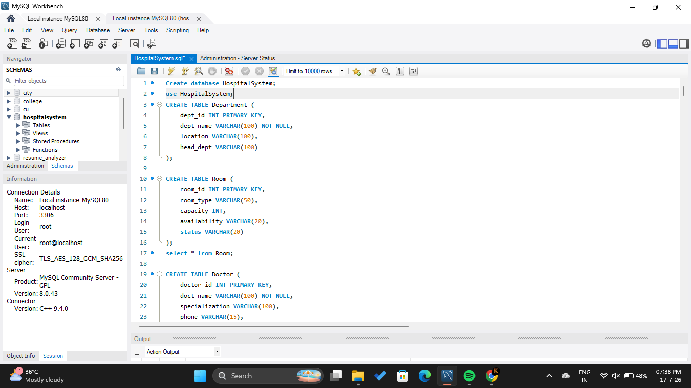
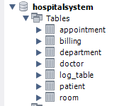
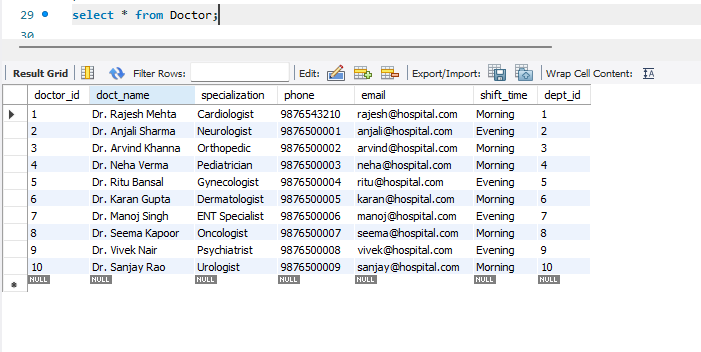
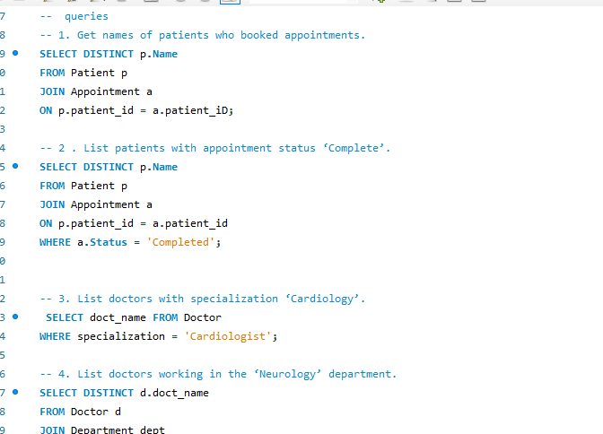
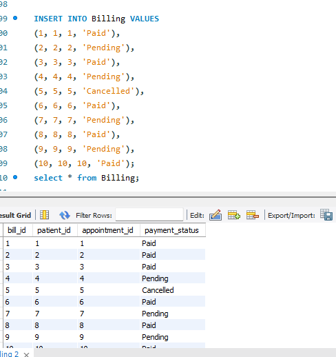

# 🏥 Hospital Appointment Management System

## 📌 Overview
The Hospital Appointment Management System is a SQL-based database project developed using MySQL. It helps manage hospital operations such as patient registration, doctor management, appointments, billing, and department records efficiently.

## ✨ Features
- Patient Management
- Doctor Management
- Department Management
- Appointment Booking
- Billing System
- SQL Joins
- Triggers
- ER Diagram
- Relational Database Design

## 🛠️ Technologies Used
- MySQL 8.0
- SQL
- MySQL Workbench

## 📂 Project Structure

```
Hospital-Appointment-Management-System
│
├── database
├── diagrams
├── PPT
├── screenshots
└── README.md
```

## 📖 Database Modules
- Patients
- Doctors
- Departments
- Rooms
- Appointments
- Billing


## 📸 Project Screenshots

### Database Connection



---

### Tables



---

### Doctor Table



---

### SQL Queries



---

### Insert Query



## 👩‍💻 Author

Khushboo Raizada

B.Tech CSE

Chitkara University